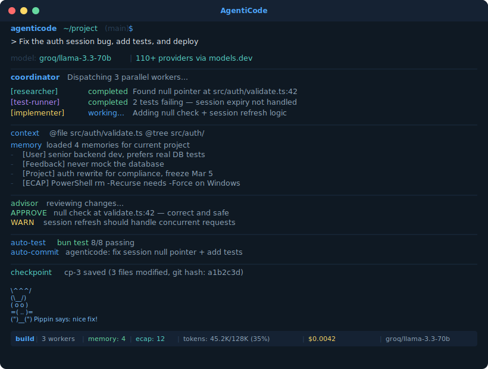

<p align="center">
  <h1 align="center">AgentiCode</h1>
</p>
<p align="center">The most feature-rich open source AI coding agent.</p>
<p align="center">
  110+ AI providers, multi-agent orchestration, cross-session memory, and everything you need in one agent.
</p>

<p align="center">
  
</p>

---

### Why AgentiCode?

AgentiCode combines the best ideas from every major AI coding agent into a single, provider-agnostic platform:

| From | What We Took |
|------|-------------|
| **Core Engine** | Full agent engine — bridge, swarm, buddy, memory, vim, 40+ tools, CLI |
| **OpenCode** | 110+ provider registry via models.dev, Electron desktop concepts |
| **Aider** | Repo map, auto-lint/test loop, git auto-commit, voice coding |
| **Cline** | Checkpoint/restore, screenshot input, browser automation |
| **Cursor** | @-mentions context system (@file, @tree, @git, @search) |
| **Goose** | Recipe YAML workflows, sandbox containers, auto-compaction, skills |
| **Claurst** | Conversation fork, session budget, advisor dual-model review |
| **ClawCode** | Experience learning (ECAP), multi-provider abstraction pattern |

### Features

| Category | What's Included |
|----------|----------------|
| **Providers** | 110+ via models.dev — OpenAI, Anthropic, Google, Groq, DeepSeek, Mistral, xAI, OpenRouter, Ollama, LM Studio, and 100 more. Online + local. |
| **Multi-Agent** | Swarm orchestration, coordinator mode, parallel workers, team management, permission bridge, advisor review |
| **Memory** | Cross-session persistence (4 types: user/feedback/project/reference), experience learning (ECAP), project hints (.agenticode/hints.md) |
| **Context** | @-mentions (@file, @tree, @git, @url, @search), image/screenshot input, repo map code graph |
| **Remote** | Bridge sessions (WebSocket + hybrid transport), remote REPL, session sync, reconnection with backoff |
| **Workflows** | Recipe YAML system with parameters and sub-recipes, planner model separation |
| **Safety** | PowerShell destructive command detection, sandbox container isolation, advisor dual-model review |
| **Dev Tools** | Auto-lint/test loops, git auto-commit, checkpoint/restore snapshots, smart auto-compaction |
| **UX** | Buddy companion sprites (18 species), vim mode, conversation fork/branch, session budget tracking |
| **Export** | Session replay in Markdown, JSON, or HTML. Full conversation history with cost tracking. |
| **Browser** | Playwright/Puppeteer MCP integration with presets for headless testing |
| **Search** | Web search via Tavily, Brave, SearXNG, or custom backends |

### Getting Started

```bash
git clone https://github.com/kyaky/agenticode.git
cd agenticode
bun install
bun start
```

Set any provider API key:
```bash
export OPENAI_API_KEY=sk-...          # OpenAI
export GROQ_API_KEY=gsk_...           # Groq
export DEEPSEEK_API_KEY=sk-...        # DeepSeek
export AGENTICODE_API_KEY=sk-ant-...  # Anthropic
# ... or any of 110+ providers
```

### Architecture

```
src/
├── bridge/              # Remote sessions (WebSocket + hybrid transport)
├── buddy/               # AI companion sprites (18 species, 5 rarities)
├── coordinator/         # Multi-agent orchestration + advisor review
├── memdir/              # Cross-session memory + ECAP experience learning
├── recipe/              # YAML workflow engine
├── vim/                 # Modal editing state machine
├── tools/               # 40+ tools + auto-fix + auto-commit + repo-map
├── services/
│   ├── api/             # Core query engine
│   └── providers/       # Provider abstraction layer
│       ├── types.ts         # Unified BaseProvider interface
│       ├── openai.ts        # OpenAI + 100 compatible endpoints
│       ├── anthropic.ts     # Native Anthropic HTTP client
│       ├── models-registry.ts  # models.dev 110+ providers
│       ├── web-search.ts    # Tavily/Brave/SearXNG
│       ├── capabilities.ts  # Thinking/caching/tool detection
│       ├── converter.ts     # Format: Internal↔OpenAI↔Anthropic↔Gemini
│       └── router.ts        # Auto-detection + factory
├── utils/
│   ├── mentions.ts      # @-mentions context system
│   ├── imageInput.ts    # Screenshot/image input
│   ├── browserAutomation.ts  # Playwright/Puppeteer MCP
│   ├── sessionExport.ts # Session replay (MD/JSON/HTML)
│   ├── sandbox.ts       # Docker container isolation
│   ├── checkpoint.ts    # File snapshot/restore
│   ├── budget.ts        # Token/cost limits
│   ├── fork.ts          # Conversation branching
│   └── auto-compact.ts  # Smart context management
├── cli/                 # Terminal UI + 87 commands
└── components/          # Ink React terminal components
```

### Provider Support

AgentiCode integrates with [models.dev](https://models.dev) for automatic provider and model discovery:

```typescript
import { searchModels, createProviderFromRegistry } from './services/providers'

// Search across all providers
const models = await searchModels("gpt-4")

// Auto-create provider from registry
const provider = await createProviderFromRegistry("groq", "llama-3.3-70b-versatile")

// Find cheapest model with tool calling
const cheap = await findCheapestModel({ needsToolCall: true })
```

**Online providers:** OpenAI, Anthropic, Google, Groq, DeepSeek, Mistral, xAI, OpenRouter, Together, Fireworks, Cerebras, Perplexity, Cohere, 302.AI, Alibaba, GitHub Copilot, GitHub Models, Azure, Bedrock, Vertex, and 90+ more.

**Local providers:** Ollama, LM Studio, llama.cpp, Jan, vLLM, LocalAI.

### License

MIT
